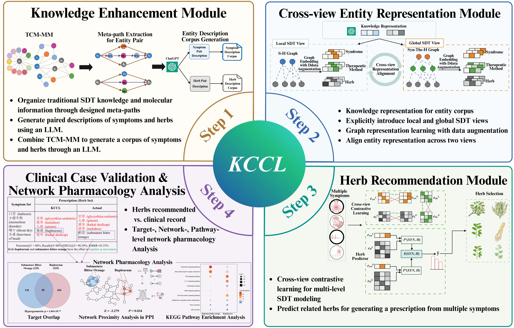

# KCCL: Knowledge-enhanced Cross-view Contrastive Learning Model for Herb Recommendation

KCCL integrates three modules: knowledge enhancement, cross-view syndrome differentiation and treatment (SDT) modeling, and herb recommendation, to automatically generate clinically meaningful herb combinations from symptom inputs and provide prescription references for TCM clinical decision-making. As the first herb recommendation framework to explicitly integrate and align local and global SDT views, KCCL is further supported by clinical case studies and network pharmacology analysis.



## Dataset

The default dataset is `Herb_BGCN`. The data size file reports:

```text
num_symptoms = 360
num_therapeutic methods = 23782
num_herbs = 753
num_syndromes = 4560
```

The main data files are located in `datasets/Herb_BGCN/`:

- `user_item*.txt`: symptom-herb interaction data
- `user_bundle*.txt`: symptom-prescription interaction data
- `set_user_bundle*.txt`: syndrome-therapeutic methods interaction data
- `bundle_item.txt`: therapeutic method-herb affiliation data
- `us_u_list`: mapping tensor from syndromes to symptoms

LLM-enhanced representations are stored in `datasets/GPT/Herb_BGCN/`:

- `vector_gpt-3.5-turbo_symptom_merge_summary.pkl`
- `vector_gpt-3.5-turbo_herb_merge_summary.pkl`

These vectors are loaded automatically by `models/KCCL_syn_P_LLM_merge.py`.

## Environment

The code was developed with PyTorch, DGL, PyTorch Geometric, SciPy, NumPy, Pandas, TensorBoardX, and Weights & Biases.

A typical setup is:

```bash
conda create -n kccl python=3.7 -kccl
conda activate kccl
pip install -r requirements.txt
```

Note: `requirements.txt` is an environment snapshot and contains several local wheel/file references. If installation fails, install the core packages manually according to your CUDA version. The most important dependencies are:

```bash
pip install torch==1.13.1 numpy==1.21.6 scipy==1.4.1 pandas==1.3.5 scikit-learn==1.0.2 tqdm tensorboardX wandb openpyxl
```

For graph-related packages, install CUDA-compatible builds of:

```bash
pip install dgl-cu111==0.6.1 torch-geometric==2.0.4
```

If you do not want to upload logs to Weights & Biases, run:

```bash
wandb offline
```

or set:

```bash
export WANDB_MODE=offline
```

On Windows PowerShell:

```powershell
$env:WANDB_MODE="offline"
```

## Training

Run KCCL on the default `Herb_BGCN` dataset:

```bash
python train_tcm_syn_P_LLM_merge.py --gpu 0 --dataset Herb_BGCN --model KCCL --config "CONFIG_reg:7e-3-pair-MD-best"
```

Main configurable parameters are defined in `config_weight.py`, including:

- `batch_size_train`: training batch size
- `topk`: recommendation cutoffs
- `aug_type`: graph embedding with data augmentation type, including `ED`(graph augmentation), `MD`(embedding augmentation ), and `OP` (None)
- `item_level_ratios`: dropout ratio for the symptom-herb graph in the local SDT view
- `bundle_level_ratios`: dropout ratio for the syndrome-therapeutic method graph in the global SDT view
- `bundle_agg_ratios`: dropout ratio for the therapeutic method-herb affiliation graph in the global SDT view
- `embedding_sizes`: embedding dimension
- `num_layerss`: graph propagation depth
- `lrs`: learning rate candidates
- `l2_regs`: L2 regularization weights
- `c_temps`: contrastive learning temperature
- `epochs`: number of training epochs
- `LLM_name`: LLM embedding source, default `gpt-3.5-turbo`


## Evaluation

To evaluate a saved model, make sure `pretrain` is set to `1` in `config_weight_test.py`, and that `save_tail`, seed, and hyperparameters match the checkpoint directory.

Then run:

```bash
python test_tcm_syn_P_LLM_merge.py --gpu 0 --dataset Herb_BGCN --model KCCL --config "CONFIG_reg:7e-3-pair-MD-best"
```

Evaluation results are saved to:

```text
visual/SYN_P_merge/result/Herb_BGCN/KCCL/result_test-CONFIG_reg:7e-3-pair-MD-best-LLM_merge-seed.xlsx
```

## Metrics

The reported metrics are:

- `Recall@K`
- `Precision@K`
- `NDCG@K`
- `RMRR@K`

The default evaluation cutoffs are:

```text
K = 5, 20
```

## Reproducibility Notes

- Default training batch size: `1024`
- Default LLM representation: `gpt-3.5-turbo`
- Default augmentation: `MD`
- Default item-level dropout ratio: `0.2`
- Default bundle-level dropout ratios: `0.15`
- Default bundle aggregation dropout ratios: `0.2`
- Default embedding size: `64`
- Default graph propagation layer: `1`
- Default learning rate candidates: `2e-4`
- Default L2 regularization weight: `7.0e-3`
- Default contrastive temperature: `0.15`
- Default number of training epochs: `2000`

CUDA nondeterminism may lead to small variations across hardware and driver versions.

## LLM Embedding Generation

The repository includes scripts under:

```text
datasets/GPT/Herb_BGCN/get_vector/
```

The `get_vector` folder contains the LLM-generated corpus files for symptoms and herbs, including merged textual descriptions and the generated semantic vector files used by KCCL.

The `response` folder contains the code for using LLMs to construct pairwise text, generate descriptive corpora, and produce embeddings for symptoms and herbs.

The released pickle files in `datasets/GPT/Herb_BGCN/` are sufficient for running the current KCCL training and evaluation scripts.

If regenerating embeddings, update `LLM_name` in the configuration so that the generated files follow this naming pattern:

```text
vector_<LLM_name>_symptom_merge_summary.pkl
vector_<LLM_name>_herb_merge_summary.pkl
```

